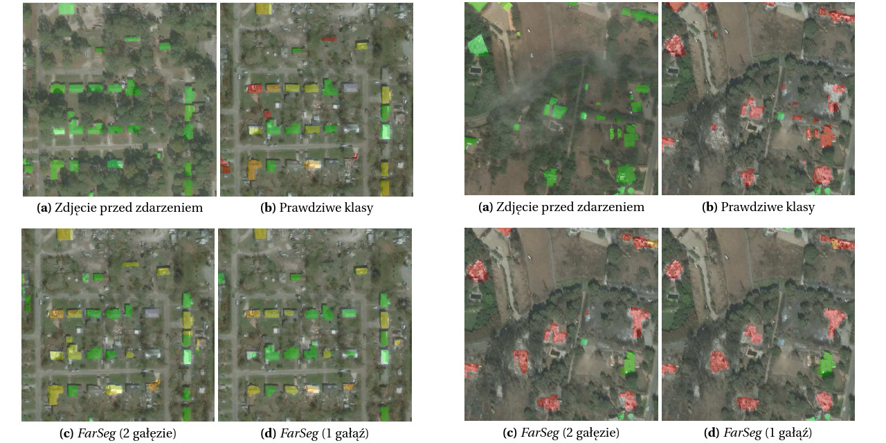

# Analysis of Aerial and Satellite Imagery for Emergency Scenarios



My BSc thesis.

Leveraging machine learning methods to analyze images of areas affected by natural disasters can accelerate crisis response; however, creating a model robust enough to analyze arbitrary photographs is a non-trivial task. The existing literature primarily focuses on achieving high performance in simultaneous building detection and damage classification using the [xBD](https://arxiv.org/abs/1911.09296) dataset, but the models' capabilities to generalize to previously unseen events or different types of images have been sparsely studied. This study analyzes the performance of selected models considering problem framing (semantic segmentation versus change detection), evaluation on unseen events, and differences in spatial resolution between training and testing data. The potential of fine-tuning and unsupervised domain adaptation to improve results was also investigated. A training and evaluation pipeline was implemented to conduct experiments. The obtained results were analyzed in terms of aggregated metric values and common patterns in model predictions. Several factors influenced the outcomes, including building density in the images, geographic differences between photographed areas, and the nature of the damages caused by the events. In some cases, applying unsupervised domain adaptation or redefining the task proved beneficial for improving result quality.

### Setup

Initialize submodules

```shell
git submodule update --init --remote
```

Install the project using [PDM](https://pdm-project.org/en/latest/)

```shell
pdm install
```

Copy the envfile and input your `wandb` API key

```shell
cp .env.sample .env
```

#### Datesets

- [xBD dataset](https://xview2.org/dataset) (51 GB download, 133 GB uncompressed, +69 GB pre-processed)

    - An account in the *xView2* challenge is required

- [FloodNet dataset](https://www.dropbox.com/scl/fo/k33qdif15ns2qv2jdxvhx/ANGaa8iPRhvlrvcKXjnmNRc?rlkey=ao2493wzl1cltonowjdbrnp7f&e=4&dl=0) (12 GB download, 13 GB uncompressed, +1 GB pre-processed)

Unpack the datasets and move / symlink them to `data/xBD` and `data/floodnet` respectively

Then, run preprocessing scripts, which will prepare the data for training:

```shell
pdm run scripts/make_data_xbd.py 512 data/xBD_processed_512 all
pdm run scripts/make_data_floodnet_rescuenet.py floodnet 512 data/rescuenet_processed_512 all
```

### Train

```shell
pdm run scripts/train.py \
    datamodule=<DATAMODULE> \
    module=<MODEL>
```

Default datamodule setup assumes a 24 GB VRAM GPU, override batch sizes if needed. Training using `tier1` and `tier3` xBD subsets converges after approximately 40 epochs and takes ~20h to train on an RTX 3090 using `BF16-mixed` precision.

### Adapt

```shell
pdm run scripts/adapt.py \
    [--events <EVENT1>,<EVENT2>,<EVENT_N>|--floodnet] \
    -d <DUMPED_HYDRA_CONFIG> \
    -c <MODEL_CHECKPOINT>
```

Find the hydra config directory (`.hydra`) and model checkpoint in output directory created during training (`outputs/experiment_name`). The dumped config will include everything you set during the training stage, including CLI overrides.

### Finetune

```shell
pdm run scripts/finetune.py \
    [--events <EVENT1>,<EVENT2>,<EVENT_N>|--floodnet] \
    -d <DUMPED_HYDRA_CONFIG> \
    -c <MODEL_CHECKPOINT>
```

### Evaluate

```shell
pdm run scripts/eval.py \
    [--events <EVENT1>,<EVENT2>,<EVENT_N>|--floodnet] \
    -d <DUMPED_HYDRA_CONFIG> \
    -c <MODEL_CHECKPOINT>
```
